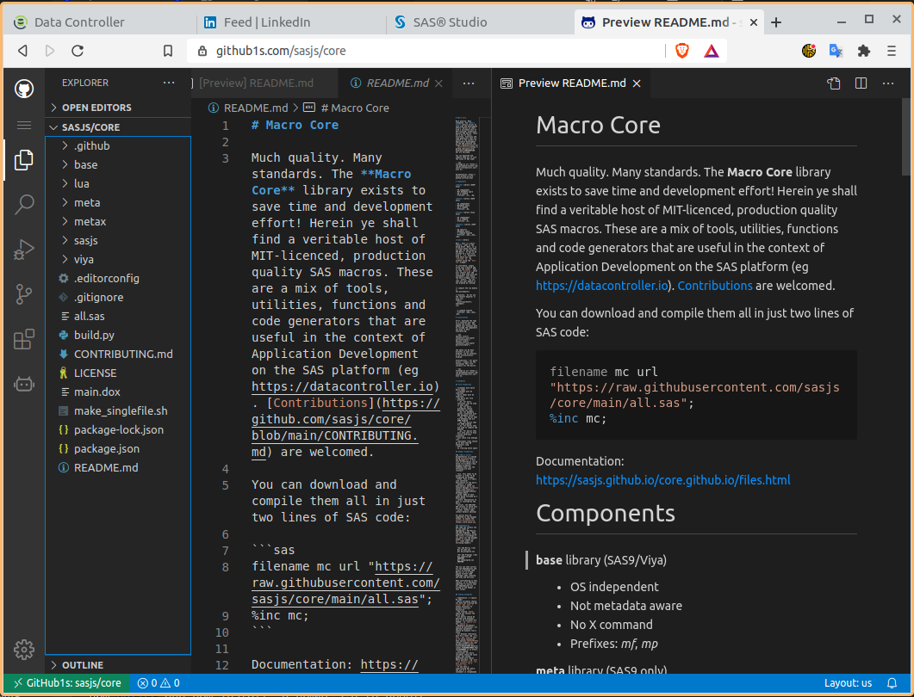

VS Code - for SAS
====================

VS Code is the worlds best IDE!  At least, that's our opinion. It's a great IDE and very usable for both SAS and Web development.  When it comes to the download, we actually recommend VSCodium - which is simply VSCode without the telemetry.  The downside of using VS

## Extensions

VS Code has many marketplace extensions - these are our favourites:

### SASjs

Obviously! This is our favourite.  It's still in early development phase, however it's already possible to submit code to Viya and return the log.  This uses the regular global sasjsconfig file, so the tokens generated can be interechanged between VS Code and the [CLI](https://cli.sasjs.io).

* Visual Studio Code Marketplace (suitable for VS Code):  https://marketplace.visualstudio.com/items?itemName=SASjs.sasjs-for-vscode
* Open VSX (Suitable for VSCodium and Theia): https://open-vsx.org/extension/sasjs/sasjs-for-vscode

### Remove Tabs on Save

The in built functionality does not apply to all tabs, eg if you are sent a file that contains tabs in a comment block.  This extension will ensure that all those nasty tabs are zapped whenever you hit SAVE!

[https://marketplace.visualstudio.com/items?itemName=redlin.remove-tabs-on-save](https://marketplace.visualstudio.com/items?itemName=redlin.remove-tabs-on-save)

### EditorConfig for VS Code
Whilst we love VS Code we also recognise that other developers may have their own IDE preferences.  For this reason we recommend that - where possible - configuration is made using the universal '.editorconfig' file .

The VS Code plugin is here: [https://marketplace.visualstudio.com/items?itemName=EditorConfig.EditorConfig](https://marketplace.visualstudio.com/items?itemName=EditorConfig.EditorConfig)

### Gremlins Tracker

When using SASjs and sharing the deploy script from one environment (eg UTF8) to another (eg WLATIN1) you can end up with code that will not run in EG due to the existence of hidden special characters.

This plugin will highlight all the rows containing such 'gremlins'.  A real time saver / problem avoider!

### Draw IO

This extension lets you build diagrams directly in VS Code!  You can save as PNG or SVG, and changes are stored as text so you can track them in GIT.

[https://marketplace.visualstudio.com/items?itemName=hediet.vscode-drawio](https://marketplace.visualstudio.com/items?itemName=hediet.vscode-drawio)

### Journal

This is actually two extensions.  The first lets you use VS Code as a task manager and work diary.  The second adds a calendar icon to the left hand side of your IDE so you can easily browse!

* [Journal](https://marketplace.visualstudio.com/items?itemName=Pajoma.vscode-journal)
* [Viewer](https://marketplace.visualstudio.com/items?itemName=Gruntfuggly.vscode-journal-view)

## Tips & Tricks

### Keyboard shortcuts

10x your productivity by committing the following to memory:

Shortcut | Result
---|---
CTRL+ALT + up or down arrow| Multiline select with the cursor
CTRL+SHIFT+P| Bring up the command pane

### Gitpod

Instant workspace in the cloud!  Just add "gitpod.io/#" prior to the url, like this:  "gitpod.io/#github.com/sasjs/core".

### Github Viewer

Are you trying to read code on github, but find it cumbersome to navigate each page?

Just add "1s" in the url between "github" and ".com" - like this: "github1s.com/sasjs/core"

And get instant VS Code in the browser!

## Applications

### Server

It is now easier than ever to set up your own cloud instance of VSCodium and access it from any browser (even on ipad!).  This means you can run your builds in a powerful (or throwaway) cloud server instance without running down your battery, or being dependent on a single device.

A guide to setting up an instance on digital ocean is available [here](https://github.com/cdr/code-server/blob/v3.8.0/doc/guide.md).
